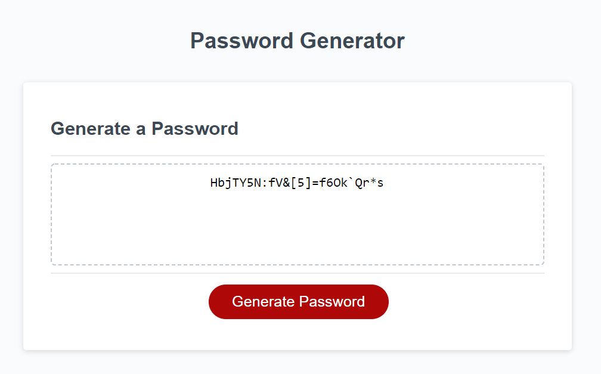

# 03 JavaScript: Password Generator

Random Password Generator

The goal of this site is to allow a user to create a secure password.

The user will be prompted for criteria for a custom password of their choice such as length of the password, and what characters they would like to see within the password.  

Below is a screen shot of the Generator:

Below is a link to the site:

https://codyg-2021.github.io/03-JavaScript-Password-Generator/

